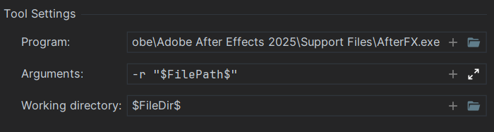

# sun-ae-ts

To install dependencies:

```bash
bun install
```

To run:

```bash
bun run build
```

This project was created using `bun init` in bun v1.1.20. [Bun](https://bun.sh) is a fast all-in-one JavaScript runtime.

To set up webstorm external tool to run scripts in ae

File/Settings/External Tools add new tool with following content


To build .jsx script manually use similar command

`tsc --noResolve --noCheck .\src\assetSuperSweep.ts --outdir dist --jsx preserve`
